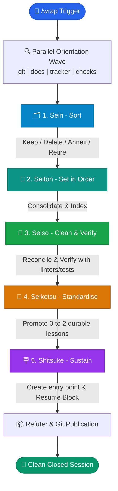

# Infographic: The `/wrap` Skill (5S Methodology)

> **Goal**: Close out a session in a **Closed** state rather than an improvised/suspended **Stopped** state, so that any developer or agent can pick up the work immediately without reconstructing context.

---

## 🎯 Key Concept: Stopped vs. Closed

```text
🔴 STOPPED: Work is done, but traces are still lying around.
   ├── Scratch files & unorganized notes
   ├── Duplicated notes & contradicting documentations
   ├── Learned lessons trapped in the context window of a single AI conversation
   └── Next developer must re-analyze the entire project to resume work.

🟢 CLOSED: Work is clean, structured, and documented.
   ├── Thorough cleanup via 5S process
   ├── Consolidation of the single source of truth
   ├── Promotion of key lessons to the right scope
   └── Clear entry point with a copy-pasteable "Resume Block" ready to run.
```

---

## 🔄 5-Phase Execution Workflow (5S Methodology)



---

## 🏛️ The 5S Phases in Detail

| Phase | Glyph | Core Role | Concrete Actions |
| :--- | :---: | :--- | :--- |
| **Seiri** | 🗂 | **Sort** *(What stays, what goes)* | • Distinguish necessary from unnecessary.<br>• Delete absorbed notes.<br>• Retain raw measurements as **annexes**.<br>• Transfer killed beliefs into a **Retired Hypotheses** table.<br>• Identify disposable zones (`scratchpad`, `.DS_Store`). |
| **Seiton** | 📍 | **Set in order** *(Put each thing in its place)* | • Consolidate scattered documents into a **Single Source of Truth**.<br>• Write the `## Provenance` section.<br>• Write the `## Retired hypotheses` table *(to prevent re-opening dead ends)*.<br>• Refresh index files and status tables. |
| **Seiso** | 🧹 | **Clean & Verify** *(Reconcile and verify)* | • Scan the repo to reconcile superseded claims across all files (headers, TL;DRs, body prose).<br>• Read what landed on the default branch *during* the session — it falsifies prose written minutes ago and shows in no diff of your own branch.<br>• Re-verify all derived numbers/metrics.<br>• Run verification commands (`markdownlint`, `pytest`).<br>• Propose rewording for external surfaces (Jira tickets/GitHub issues). |
| **Seiketsu** | 📐 | **Standardise** *(Promote the lesson)* | • Identify **0 to 2 durable lessons** maximum.<br>• Route each lesson by scope:<br>  - Local: Topic doc<br>  - Operational: Skill (`.claude/skills/`)<br>  - Fleet-wide: `AGENTS.md`<br>  - Architecture: ADR (`architecture/adr/`) |
| **Shitsuke** | 🪧 | **Sustain** *(The entry point)* | • Write the entry point section:<br>  1. What is settled<br>  2. What is still open (*Ranked open list*)<br>  3. False contradictions<br>  4. Pointer to `## Provenance`<br>• Provide a copy-pasteable **Resume Block**. |

---

## ⚡ Parallel Orientation Wave (Read-Only)

Before making any edits, the skill launches **one wave of concurrent read-only collectors**.
These four and the refuter at the end are the *only* subagents `wrap` uses, and
typing `/wrap` is what authorises them — several harnesses stand off subagents
unless the user asked. A harness that refuses anyway gets a serial read and an
output that names what went unverified:

```text
┌────────────────────────────────────────────────────────────────────────┐
│                      PARALLEL ORIENTATION WAVE                         │
├───────────────┬────────────────────────────────────────────────────────┤
│ 🐙 Git        │ Commits, status, diff, merged branches, worktrees      │
│ 📄 Docs       │ Grep fan-out over unchanged files touching the subject │
│ 🎯 Tracker    │ Impacted Jira tickets / GitHub issues                  │
│ 🧪 Checks     │ Unit tests, linters, link verifications                │
└───────────────┴────────────────────────────────────────────────────────┘
```

---

## 🔒 Autonomy Contract & Safety Gates

The skill strictly distinguishes between automatic actions and those requiring explicit user confirmation:

> [!NOTE]
> The skill directly handles reconciliation and documentation tasks, but **always** asks for confirmation before deletions, file moves, or publishing.

```text
┌─────────────────────────────────────────────────┬──────────────────────┐
│ Action                                          │ Mode                 │
├─────────────────────────────────────────────────┼──────────────────────┤
│ Reconcile a document with a superseded claim    │ ⚡ Auto & Report     │
│ Refresh an index or status table                │ ⚡ Auto & Report     │
│ Run linter and unit tests                       │ ⚡ Auto & Verbatim   │
│ Append a durable lesson to `AGENTS.md` or ADR   │ ⚡ Auto & Report     │
│ Write the Resume Block (Shitsuke)               │ ⚡ Auto & Report     │
├─────────────────────────────────────────────────┼──────────────────────┤
│ 🗑️ Delete a file or branch                       │ 🛡️ Propose & Wait    │
│ 🚚 Move / Relocate a file                       │ 🛡️ Propose & Wait    │
│ 💬 Edit a Jira ticket / GitHub issue            │ 🛡️ Propose & Wait    │
│ 🚀 Execute Git publication (Commit/Push/PR)     │ 🛡️ Propose & Wait    │
└─────────────────────────────────────────────────┴──────────────────────┘
```

---

## 📋 The "Resume Block"

At the end of **Shitsuke**, the skill produces a fenced block ready to copy-paste into the next session:

```markdown
Context: Milestone queue-pacing investigation concluded.
Read first: docs/queue-pacing/README.md (Section "What is settled").
Next action: Implement the parser buffer fix proposed in issue #142.
Verification command: uv run pytest tests/test_parser.py
```

---

## 💎 Golden Rules of `/wrap`

1. **One commit is one idea**: Never bundle cleanup, lessons, and doc reconciliation into a single commit.
2. **Conclusion-first commit subjects**: Prefer `fix(parser): budget closed, parser is per-work bottleneck` over `update docs`.
3. **Report reality, not wishes**: If a phase finds nothing to do, report "nothing" and move on.
4. **Supersede, do not erase history**: Retract wrong claims with pointers to the new truth instead of silently overwriting history.
